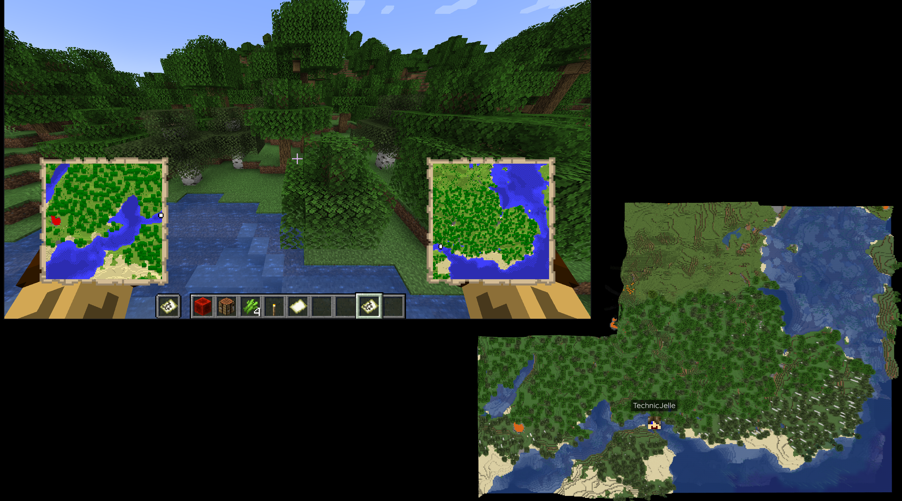

# BlueMap MC Map Sync

With this Paper plugin installed, your BlueMap will be completely blank to begin with.  
You can then use `/bmdiscover` with a map in your hand to sync that map with the BlueMap map.

Once you install this plugin, you probably want to start with a fresh map,
which you can do by running `/bluemap purge <map-id>` for each map you want to reset.

This plugin creates a config file for each BlueMap map that you have registered with BlueMap itself.  
Each config file contains a toggle with which you can enable Debug Mode.  
When Debug Mode is enabled, the plugin will log more information to the console, but more importantly,
it creates markers around every discovered area, so you can see where the plugin concluded that the map is.  
The config also contains a list of all the discovered areas. I do not recommend editing it by hand,
but it should prove simple enough to understand, in case you feel the need to mess around with it.

You can reload the configs by reloading BlueMap itself, which is `/bluemap reload`.

## [Click here to download!](../../releases/latest)

## Support

To get support with this plugin, join the [BlueMap Discord server](https://bluecolo.red/map-discord)
and ask your questions in [#3rd-party-support](https://discord.com/channels/665868367416131594/863844716047106068).  
You're welcome to ping me, @TechnicJelle.

# Build instructions
* Install [Maven](https://maven.apache.org/download.cgi)
* Clone this repository
* Run `mvn clean install` in the root directory of the repository
* The built jar file will be in the `target` directory

### Auto Discover
*New feature!*  Any time a map is created, it will be automatically discovered and synced with BlueMap.

To opt in to this feature, set `auto-discover` to `true` in the `config.yml` file.
